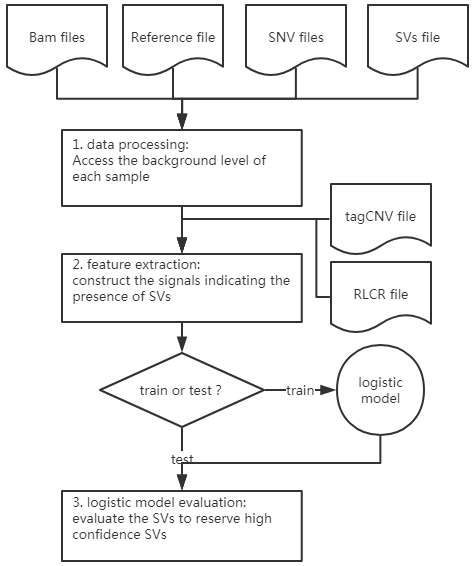

# Structural Variation Filter

---
## Table of Contents

* [User Guide](#user-guide)
   * [Configuration](#configuration)
   * [Run](#run-svf)
   * [Input](#input)
   * [Output](#output)
* [Requirements](#requirements)
* [Contact](#contact)
---



---

## User Guide

---

### Configuration

```
# download svf files  
$ wget https://github.com/xueyeduzhuo/svf/archive/master.zip

# decompress it on your server
$ unzip svf-master.zip

# enter svf master
$ cd svf-master

```

### Run svf

```
# under svf master directory
$ ./svf.sh
or
$ python svf.py feature -b <*.bam> -c <*.vcf.gz>  -v <*.vcf.gz> -o <*_feature.txt> -g hg19 -f <*.fa>

```

### Input

svf requires aligned files(.bam format), SV files(.vcf.gz format or .bed format) , SNV files(.vcf.gz format).

```
$ python svf.py pipeline -b <*.bam> -c <*.vcf.gz> -v <*.vcf.gz ...> -o <*.txt> -g hg19 -f <*.fa> 
```


### Output
 
 Output is generated in the current working directory by default.

```
$ svf ... -o <*.txt>
``` 
 


---


## Requirements
* python 2.7
  * numpy
  * pybedtools
  * pysam 0.9+
  * scikit-learn v0.19+
  * multiprocessing
  * vcf
  

* bedtools 2.25.0 or later

---

## Contact
xlwu@hit.edu.cn
